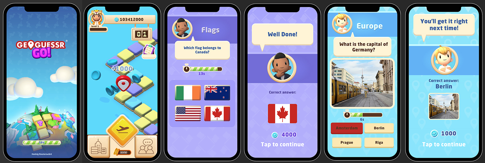
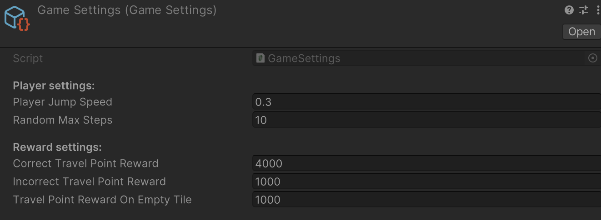
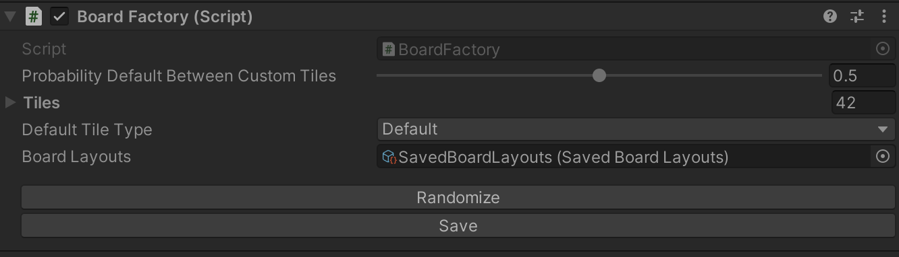
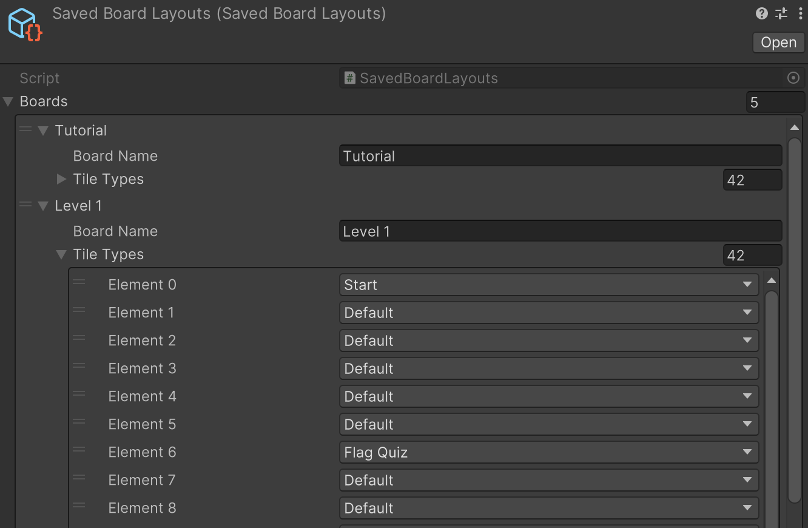

# 🦩Flamingo Codetest
A work sample by [**Hedvig Reuterswärd** ✨](https://www.linkedin.com/in/hedvigreut/)

---

## Introduction
This is my worksample for the flamingo code test. The game will take you through the following screens.

>### 🛠️ Tools Used
> - **Unity 2022.3.18f1**
> - **Adobe Photoshop** - mainly for UI assets
> - **Audacity** - record haptic audio
> - **Meta Haptic Studio** - convert audio to .haptic clips

>### 🔌 Plugins Used
>- [DOTween](https://assetstore.unity.com/packages/tools/animation/dotween-hotween-v2-27676)
>- [Nice Vibrations](https://github.com/Lofelt/NiceVibrations)
   >  *my favorite asset for haptic feedback since it works great on mobile and consoles and also it works with .haptic clips*

## Game Flow
1. Splash Screen that asynchronously loads the game (Board Scene)
2. Board Scene is loaded
3. Click the main button to get a random value between 1 and 10
4. There is a random number for steps to take shown in counter UI 
5. The player moves the correct amount of steps 
6. If you land on an empty default tile, you're rewarded an amount and coin particle plays
7. You can also land on flag quiz or picture quiz where you will answer a question
8. Depending on the answer, you are rewarded more or less travel points
9. When landing/passing by the Start tile we change the board for a new one (from the SavedBoardLayouts SO)
10. You can create new boards and edit the order of the boards
11. Your progress is saved inbetween sessions, feel free to come back to your last position on the same board
12. There is also some game settings to play around with if you want to tweak the game more

## How to create a board
1. In Play mode select the **BoardFactory** in the hierarchy of Board scene

2. On the **BoardFactory** editor window click the button **Randomize** followed by **Save**, this will create a randomized board and save it in the **SavedBoardLayouts** Scriptable Object
3. In the **SavedBoardLayouts** SO, you will see your board. You can edit the whole board by changing the type of tile and the name of this new board.

>**📋**
> There is no need to Randomize the board before saving if you don't want it like that, the level designer can in Play Mode change the individual tile types in the current board and then procede to save it.

## What I could have done better
I focused on the game as a product in someone's hand and the user experience of a nice interactive mobile game with functionality. So there is definitely room of improvement for more love on the overall architecture, separation of concerns into smaller scripts and neatness of code. I looked into Zenject but with the time and priorities I had, it will have to be for my next project! Having a robust way to enforce dependency injection, memory handling and structure would have been terrific. I am well aware that better naming and separation of concerns for example separating BoardController to not do too much would be a great upgrade. In extension, separating UI from the game logic could also be done for better separating, testing an debugging.

## What I'm most proud over
The ability to customise the board with both total randomness (except for preserving space between quiz tiles) as well as having full control if you want to is a great way of creating more boards and gameplay. Smooth and funky animations also makes the game more interesting and were super fun to make! A scalable UI for iOS means it works on both iPhone and iPad. As a last step, I also had time to add haptics which feels great in your hand in the mobile build!

## Main Classes
- GameSettings - Some basic game settings
- SavedBoardLayouts - SO for the randomised or customised boards
- BoardController - Responsible for the board interaction gameplay 
- BoardFactory - Responsible for loading and providing a board of tiles that are usable to BoardController
- FlagQuizController - Handles the flag quiz game
- PictureQuizController - - Handles the picture quiz game
- QuizReader: Reads the JSON file given
- PlayerDataManager - handles our Player pref saved data

## Scene Management & more quizzes
In mobile it is important to optimise as to not kill performance and memory. I chose to load quiz scenes additively so that when they are needed they are loaded and when they are not needed they unload. 
In the quizzes it is easy to add JSON with more questions like the extended versions I've attached. Bear in mind that you need pictures for any new questions added so that we can map an id to an image and a country name with QuizVisualsData.
One can also add more types of quizzes if needed, there is the enum type that the new type can be added to and the QuizController already takes care of the basic functionality for asking a question and evaluating an answer.